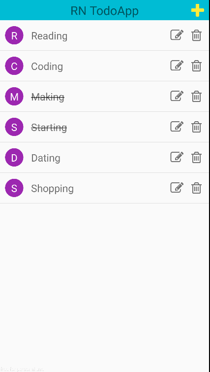
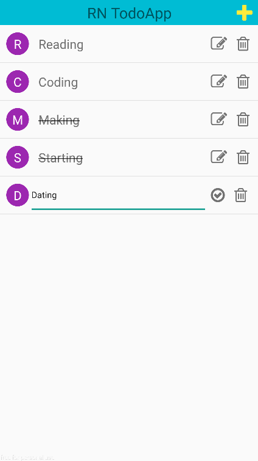
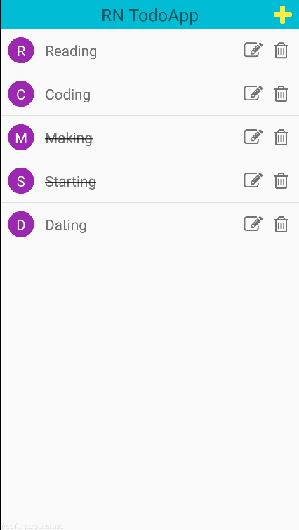

# React Native Redux TodoApp
This is a TodoApp(runs on iOS/Android with the same codebase) which builds with React Native, Redux and Immutable.js. 

## Setup
Please check out the [Official Site Setup](https://facebook.github.io/react-native/docs/getting-started.html) first ! 

1. Homebrew
2. Node
3. React Native Command Line Tools #
4. Watchman
5. Flow
6. Xcode(iOS only)

## Screenshot

## Usage 
### iOS
1. open your terminal
2. `$git clone https://github.com/kdchang/react-native-redux-immutablejs-todo.git`
3. open `ios/ReactNativeReduxTodo.xcodeproj` and hit the Run button in Xcode.

### Android
1. open your terminal
2. `$git clone https://github.com/kdchang/react-native-redux-immutablejs-todo.git`
3. `$cd react-native-redux-immutablejs-todo`
4. check your devices or simulator is ready (`$adb devices`)
5. `$react-native run-android`	

## Dependencies
1. react 15.0.2
2. react-native 0.26.1
3. redux
4. react-redux
5. redux-actions
6. redux-immutable
7. redux-logger
8. redux-thunk
9. immutable 
10. react-native-vector-icons
11. uuid

## References
1. [React Native 官方網站](https://facebook.github.io/react-native/)
2. [React 官方網站](https://facebook.github.io/react/)
3. [Redux 官方文件](http://redux.js.org/index.html)

## License
MIT